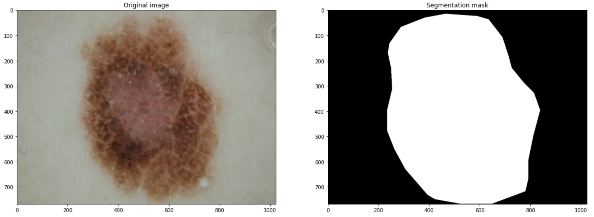
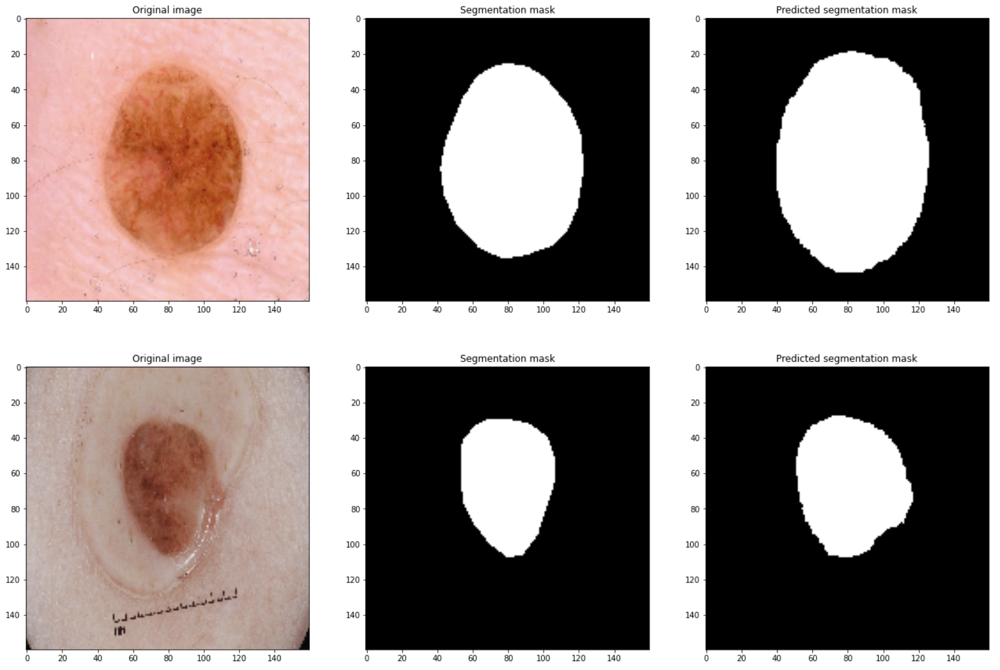

# ISIC Challenge - Lesion Segmentation 🩻👨‍⚕️🤖 
ISIC Challenge - Lesion Segmentation task solved by [Mario Lozano Cortés](https://github.com/SrLozano), Artificial Intelligence master's student at _Universitat de Barcelona_ and _Universitat Politècnica de Catalunya · BarcelonaTech - UPC_. The resolution of this task is part of the Deep Learning for Medical Image Analysis subject.

## Goal of the project 💥💯
The overarching goal of this challenge is to **develop image analysis tools to enable the automated diagnosis of melanoma from dermoscopic images**. Skin cancer is a major public health problem, with over 5,000,000 newly diagnosed cases in the United States every year. Melanoma is the deadliest form of skin cancer, responsible for an overwhelming majority of skin cancer deaths. In 2015, the global incidence of melanoma was estimated to be over 350,000 cases, with almost 60,000 deaths. Although the mortality is significant, when detected early, melanoma survival exceeds 95%. Thus, the goal is to get the highest possible **Jaccard Score** on the test set.

## The dataset 🗂🏥

The training data file contains **900 dermoscopic lesion images** in JPEG format, along with the corresponding segmentation mask.

The ISIC Lesion segmentation dataset is originally introduced in the [ISIC Challenge webpage](https://challenge.isic-archive.com/).  The 2016 challenge will be used in this project.



Data is expected at the dataset folder. In this folder two other folders are expected:

- Training_Data: All the images that are going to be used in the task.  The images can be found in the following [link](https://challenge.isic-archive.com/landing/2016/37/).
- Training_GroundTruth: Segmentations for the images at the training data.

## Architecture proposed 🏛

- **U-Net Xception-style model**
-  Learning rate = 0.001
- Optimizer = RMSProp
- Batch size = 16

```python
### [First half of the network: downsampling inputs] ###

# Entry block
x = layers.Conv2D(32, 3, strides=2, padding="same")(inputs)
x = layers.BatchNormalization()(x)
x = layers.Activation("relu")(x)

previous_block_activation = x  # Set aside residual

# Blocks 1, 2, 3 are identical apart from the feature depth.
for filters in [64, 128, 256]:
    x = layers.Activation("relu")(x)
    x = layers.SeparableConv2D(filters, 3, padding="same")(x)
    x = layers.BatchNormalization()(x)

    x = layers.Activation("relu")(x)
    x = layers.SeparableConv2D(filters, 3, padding="same")(x)
    x = layers.BatchNormalization()(x)

    x = layers.MaxPooling2D(3, strides=2, padding="same")(x)

    # Project residual
    residual = layers.Conv2D(filters, 1, strides=2, padding="same")(
        previous_block_activation
    )
    x = layers.add([x, residual])  # Add back residual
    previous_block_activation = x  # Set aside next residual

### [Second half of the network: upsampling inputs] ###

for filters in [256, 128, 64, 32]:
    x = layers.Activation("relu")(x)
    x = layers.Conv2DTranspose(filters, 3, padding="same")(x)
    x = layers.BatchNormalization()(x)

    x = layers.Activation("relu")(x)
    x = layers.Conv2DTranspose(filters, 3, padding="same")(x)
    x = layers.BatchNormalization()(x)

    x = layers.UpSampling2D(2)(x)

    # Project residual
    residual = layers.UpSampling2D(2)(previous_block_activation)
    residual = layers.Conv2D(filters, 1, padding="same")(residual)
    x = layers.add([x, residual])  # Add back residual
    previous_block_activation = x  # Set aside next residual

# Add a per-pixel classification layer
outputs = layers.Conv2D(num_classes, 3, activation="softmax", padding="same")(x)
```

## Run it 🚀

Run *isic-2016-challenge-lesion-segmentation.ipynb* in order to train the selected model.

## Results 📊

**Jaccard score on test set: 0.815 **

**Dice score on test set: 0.950**

**Pixel accuracy on test set: 0.951**

**Sensitivity score on test set: 0.919**

**Specificity score on test set: 0.970**




## Next updates 🔜
Improve performance

## Want to collaborate? 🙋🏻
Feel free to improve and optimize the existing code. To contribute to the project, read the previous points carefully and do the next steps with the project:
1. Fork it (<https://github.com/SrLozano/ISIC-2016_Challenge-Lesion-Segmentation>)
2. Create your feature branch (`git checkout -b feature/ISIC-2016_Challenge-Lesion-Segmentation`)
3. Commit your changes (`git commit -am 'Increased accuracy to ...'`)
4. Push to the branch (`git push origin feature/ISIC-2016_Challenge-Lesion-Segmentation`)
5. Create a new Pull Request

## Need help ❓
Feel free to contact the developer if you have any questions or suggestions about the project or how you can help with it.
